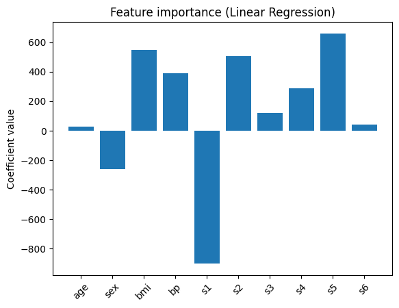
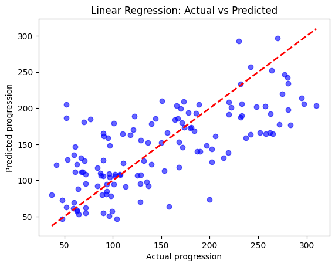

# 🩺 Diabetes Progression Prediction using Linear Regression

##  Project Overview

This project applies **Linear Regression** on the **Diabetes dataset** (scikit-learn) to predict disease progression based on clinical features (age, BMI, blood pressure, blood serum measures, etc.).

The main objective is to demonstrate a **regression pipeline**:

* Load and split the dataset.
* Train a regression model.
* Evaluate model performance with standard metrics.
* Visualize predictions and interpret results.

---

##  Dataset

* Source: `sklearn.datasets.load_diabetes()`
* **Samples:** 442 patients
* **Features:** 10 (normalized clinical variables: age, sex, BMI, BP, and 6 blood serum values)
* **Target:** Quantitative measure of diabetes progression (1 year after baseline).

---

##  Methodology

1. **Data Split:** 70% training / 30% testing
2. **Model:** `LinearRegression` from `sklearn.linear_model`
3. **Evaluation Metrics:**

   * Mean Absolute Error (MAE)
   * Mean Squared Error (MSE)
   * R-squared (R²)

---

##  Results

* **Mean Absolute Error (MAE):** \~41.9
* **Mean Squared Error (MSE):** \~2821.8
* **R² Score:** \~0.48

### Interpretation

* Model explains **≈48% of variance** in disease progression.
* Errors are relatively high compared to target scale → performance is **weak**.
* Confirms that **linear relationships are insufficient** to fully capture the complexity of this medical dataset.

---

## Visualizations

### 1. Predicted vs Actual Values

Scatter plot showing model predictions against true target values.



 **Interpretation:**

* Ideal model → points fall exactly on the red diagonal.
* Our model → points are widely scattered → confirms **weak predictive accuracy**.

---

### 2. Feature Coefficients

Bar chart of regression coefficients for feature importance.



 **Insight:** BMI and serum glucose (s5) are the strongest predictors of diabetes progression.

---

##  Conclusion

* **Linear Regression baseline** → not strong (R² ≈ 0.48).
* Useful for illustrating regression workflow.
* To improve:

  * Apply **regularization (Ridge, Lasso)**.
  * Explore **non-linear models (Decision Trees, Random Forest, Gradient Boosting)**.

---

##  Dependencies

```bash
python 3.x
scikit-learn
matplotlib
numpy
```

---

